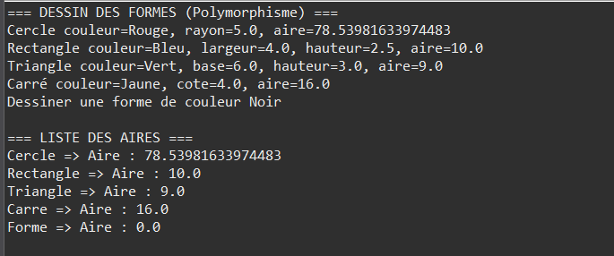

# Exercise 1: Shape Drawing System



## Objective
Learn to define and exploit polymorphism in Java by creating a superclass `Forme` and several subclasses that override the `dessiner()` method. Store these heterogeneous objects in a single array and uniformly invoke `dessiner()` on each, demonstrating dynamic binding.

## Description
This exercise demonstrates the core concept of polymorphism in Java. Different shape types are stored in a single array and their drawing methods are invoked uniformly, with Java automatically calling the correct version based on the actual object type at runtime.

## Class Structure

### Forme (Shape - Base Class)
Located in `com.example.tp` package

**Attributes:**
- `couleur` (protected String): Shape color

**Constructor:**
```java
public Forme(String couleur)
```

**Methods:**
- `dessiner()`: Generic drawing method that can be overridden by subclasses

**Default Implementation:**
```java
public void dessiner() {
    System.out.println("Dessiner une forme de couleur " + couleur);
}
```

### Cercle (Circle)

**Attributes:**
- Inherits `couleur` from Forme
- `rayon` (private double): Circle radius

**Constructor:**
```java
public Cercle(String couleur, double rayon)
```

**Overridden Methods:**
```java
@Override
public void dessiner() {
    System.out.println("Dessiner un cercle de couleur "
        + couleur + " et de rayon " + rayon);
}
```

### Rectangle

**Attributes:**
- Inherits `couleur` from Forme
- `largeur` (private double): Width
- `hauteur` (private double): Height

**Constructor:**
```java
public Rectangle(String couleur, double largeur, double hauteur)
```

**Overridden Methods:**
```java
@Override
public void dessiner() {
    System.out.println("Dessiner un rectangle de couleur "
        + couleur + ", largeur=" + largeur
        + ", hauteur=" + hauteur);
}
```

### Triangle

**Attributes:**
- Inherits `couleur` from Forme
- `base` (private double): Triangle base
- `hauteur` (private double): Triangle height

**Constructor:**
```java
public Triangle(String couleur, double base, double hauteur)
```

**Overridden Methods:**
```java
@Override
public void dessiner() {
    System.out.println("Dessiner un triangle de couleur "
        + couleur + ", base=" + base
        + ", hauteur=" + hauteur);
}
```

## Polymorphism in Action

### Heterogeneous Array
```java
Forme[] formes = new Forme[] {
    new Cercle("Rouge", 5.0),
    new Rectangle("Bleu", 4.0, 3.0),
    new Triangle("Vert", 6.0, 2.5),
    new Forme("Noir")     // Generic shape
};
```

**Key Point:** Array is declared as `Forme[]` but holds different shape types!

### Dynamic Method Invocation
```java
for (Forme f : formes) {
    f.dessiner();  // Calls the correct version dynamically
}
```

**What Happens:**
- `f.dessiner()` is called on each element
- Java doesn't use the variable type (Forme)
- Java uses the actual object type (Cercle, Rectangle, Triangle, etc.)
- The correct overridden method is invoked automatically

## Polymorphism Explanation

### Variable Type vs Object Type
```java
Forme f = new Cercle("Rouge", 5.0);
```
- **Variable type**: `Forme` (compile-time type)
- **Object type**: `Cercle` (runtime type)

### Dynamic Binding (Late Binding)
When `f.dessiner()` is called:
1. Java checks the actual object type at **runtime**
2. Finds that it's a `Cercle` object
3. Invokes `Cercle.dessiner()` method (not `Forme.dessiner()`)
4. This is called **dynamic dispatch** or **dynamic binding**

### Advantage
- **Generic code**: The loop works for all shapes
- **Extensible**: Add new shapes without modifying Main
- **Maintainable**: Single interface for all shapes
- **Type-safe**: Compiler ensures all objects have `dessiner()` method

## Example Usage

```java
public class Main {
    public static void main(String[] args) {
        // Create heterogeneous array
        Forme[] formes = new Forme[] {
            new Cercle("Rouge", 5.0),
            new Rectangle("Bleu", 4.0, 3.0),
            new Triangle("Vert", 6.0, 2.5),
            new Forme("Noir")
        };

        // Polymorphism in action
        for (Forme f : formes) {
            f.dessiner();  // Dynamic method invocation
        }
    }
}
```

## Expected Output

```
Dessiner un cercle de couleur Rouge et de rayon 5.0
Dessiner un rectangle de couleur Bleu, largeur=4.0, hauteur=3.0
Dessiner un triangle de couleur Vert, base=6.0, hauteur=2.5
Dessiner une forme de couleur Noir
```

## Compilation & Execution

```bash
# From src/ directory
cd src
javac com/example/tp/*.java
java com.example.tp.Main
```

## Key Concepts Demonstrated

### 1. Polymorphism
- Single reference type (`Forme`) holds multiple object types
- Uniform interface (`dessiner()`) for different implementations
- Runtime type determines which method is called

### 2. Method Overriding
- Subclasses provide specialized implementations
- `@Override` annotation for clarity and compile-time checking
- Maintains method signature from parent class

### 3. Protected Access
- `couleur` is protected, accessible to subclasses
- Demonstrates proper encapsulation with inheritance

### 4. Dynamic Binding
- Method resolution happens at runtime
- Based on actual object type, not reference type
- Enables flexible and extensible code

## Polymorphism Benefits

### Extensibility
Add new shape without modifying existing code:
```java
public class Ellipse extends Forme {
    // New shape implementation
}
```
Main loop continues to work without changes!

### Code Reusability
```java
public void dessinerTous(Forme[] formes) {
    for (Forme f : formes) {
        f.dessiner();  // Works for all current and future shapes
    }
}
```

### Maintainability
- Single point of change for new shapes
- Reduces code duplication
- Clear separation of concerns

## Verification Checklist
- [ ] All shapes override `dessiner()` method
- [ ] Array declared as `Forme[]` holds all shape types
- [ ] Each `dessiner()` call produces correct output
- [ ] Adding new shape doesn't require Main modification
- [ ] Protected `couleur` accessible in all subclasses
- [ ] Output matches expected format

## Possible Extensions

### 1. Add Area Calculation
```java
public abstract double aire();
```
Each shape implements its area formula.

### 2. Add New Shapes
- `Carre` (Square) - special Rectangle
- `Ellipse` - generalized Circle
- `Polygone` - multi-sided shape

### 3. Sorting by Area
Implement `Comparable<Forme>`:
```java
public class Forme implements Comparable<Forme> {
    @Override
    public int compareTo(Forme autre) {
        return Double.compare(this.aire(), autre.aire());
    }
}
```

### 4. Drawing to Graphics Context
```java
public abstract void dessiner(Graphics g);
```
Implement actual graphical drawing.

### 5. Perimeter Calculation
```java
public abstract double perimetre();
```

### 6. Shape Properties
- Add `estRegulier()` method
- Add `getType()` for shape identification
- Add `getVertices()` for polygons

## Advanced Topics

### Polymorphism vs. Type Checking
```java
// Bad practice
if (f instanceof Cercle) {
    ((Cercle)f).dessiner();
} else if (f instanceof Rectangle) {
    ((Rectangle)f).dessiner();
}

// Good practice - use polymorphism
f.dessiner();  // Let Java choose the right method
```

### Compile-Time vs. Runtime Type
```java
Forme f = new Cercle("Rouge", 5.0);
// f.getClass() returns Cercle.class (runtime type)
// Declared type is Forme (compile-time type)
```

## Common Mistakes to Avoid

### 1. Forgetting @Override
```java
// Typo - creates new method instead of overriding
public void desiner() { }  // Wrong spelling

// Compiler catches error with @Override
@Override
public void desiner() { }  // Compile error!
```

### 2. Using Private in Parent
```java
// Bad - subclasses can't access
private String couleur;

// Good - subclasses can access
protected String couleur;
```

### 3. Not Calling super()
```java
// May miss parent initialization
public Cercle(String couleur, double rayon) {
    this.rayon = rayon;  // couleur not set!
}

// Correct
public Cercle(String couleur, double rayon) {
    super(couleur);  // Initialize parent
    this.rayon = rayon;
}
```

## Files
- `Forme.java`: Base shape class with color
- `Cercle.java`: Circle with radius
- `Rectangle.java`: Rectangle with width and height
- `Triangle.java`: Triangle with base and height
- `Main.java`: Test program demonstrating polymorphism
- `subject.txt`: Complete exercise specifications

## Learning Outcomes
After completing this exercise, you should understand:
- How polymorphism enables generic code
- The difference between compile-time and runtime types
- How Java resolves method calls dynamically
- Why polymorphism leads to extensible and maintainable code
- The relationship between inheritance and polymorphism
