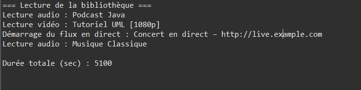

# Exercise 2: Multimedia Library Management



## Objective
Implement polymorphism with a Media class hierarchy (Audio, Video, LiveStream) that overrides `lire()` and `getDuree()` methods, demonstrating dynamic binding.

## Key Concepts
- Abstract methods for forced implementation
- Polymorphism with different return types
- Dynamic array management
- LiveStream with special duration behavior (-1)

## Implementation

### Media (Base Class)
```java
package com.example.tp;

public class Media {
    protected String titre;

    public Media(String titre) {
        this.titre = titre;
    }

    public void lire() {
        System.out.println("Lecture de : " + titre);
    }

    public int getDuree() {
        return 0;  // Default
    }
}
```

### Audio
```java
public class Audio extends Media {
    private int duree;  // in seconds

    public Audio(String titre, int duree) {
        super(titre);
        this.duree = duree;
    }

    @Override
    public void lire() {
        System.out.println("Lecture audio : " + titre + " (" + duree + "s)");
    }

    @Override
    public int getDuree() {
        return duree;
    }
}
```

### Video
```java
public class Video extends Media {
    private int duree;
    private String resolution;

    public Video(String titre, int duree, String resolution) {
        super(titre);
        this.duree = duree;
        this.resolution = resolution;
    }

    @Override
    public void lire() {
        System.out.println("Lecture vidéo : " + titre +
                           " (" + duree + "s, " + resolution + ")");
    }

    @Override
    public int getDuree() {
        return duree;
    }
}
```

### LiveStream
```java
public class LiveStream extends Media {
    private String url;

    public LiveStream(String titre, String url) {
        super(titre);
        this.url = url;
    }

    @Override
    public void lire() {
        System.out.println("Stream en direct : " + titre + " [" + url + "]");
    }

    @Override
    public int getDuree() {
        return -1;  // Live stream = undefined duration
    }
}
```

### MediaLibrary
```java
public class MediaLibrary {
    private Media[] items = new Media[4];
    private int count = 0;

    public void add(Media m) {
        if (count == items.length) {
            Media[] tmp = new Media[items.length * 2];
            System.arraycopy(items, 0, tmp, 0, items.length);
            items = tmp;
        }
        items[count++] = m;
    }

    public void playAll() {
        for (int i = 0; i < count; i++) {
            items[i].lire();
        }
    }

    public int totalDuration() {
        int total = 0;
        for (int i = 0; i < count; i++) {
            int d = items[i].getDuree();
            if (d > 0) total += d;  // Skip live streams (-1)
        }
        return total;
    }
}
```

## Usage Example
```java
public class Main {
    public static void main(String[] args) {
        MediaLibrary library = new MediaLibrary();

        library.add(new Audio("Song.mp3", 180));
        library.add(new Video("Movie.mp4", 7200, "1920x1080"));
        library.add(new LiveStream("News", "http://live.example.com"));

        library.playAll();
        System.out.println("Total duration: " + library.totalDuration() + "s");
    }
}
```

## Expected Output
```
Lecture audio : Song.mp3 (180s)
Lecture vidéo : Movie.mp4 (7200s, 1920x1080)
Stream en direct : News [http://live.example.com]
Total duration: 7380s
```

## Compilation & Execution
```bash
cd src
javac com/example/tp/*.java
java com.example.tp.Main
```

## Polymorphism Features
- **Uniform storage:** All media types in `Media[]` array
- **Dynamic dispatch:** `lire()` calls correct version at runtime
- **Special cases:** LiveStream returns -1 for duration
- **Type-specific behavior:** Each class has unique implementation

## Extensions
- Add `pause()` and `stop()` methods
- Implement `Playlist` class with ordering
- Add media rating system
- Filter by type or duration
- Add download feature for non-live content
